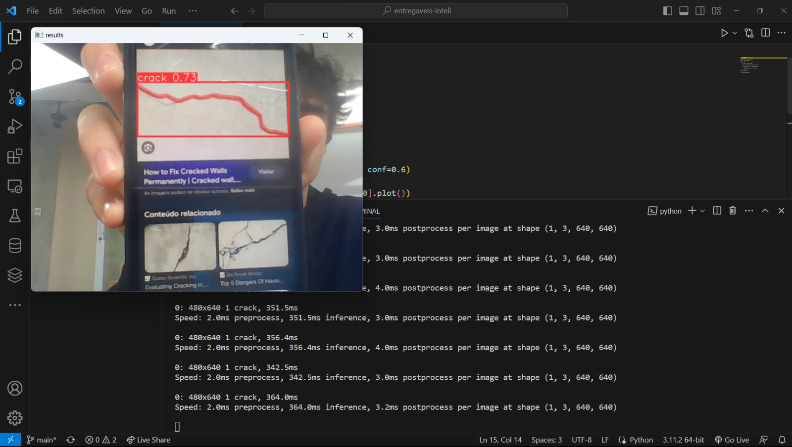

Fiz um modelo usando YoloV8 no colab, depois fiz download do modelo como o arquivo de 'best.pt' e usei ele para fazer a detecção do rachaduras usando o opencv. O notebook do colab foi baixado e está no arquivo com o nome de 'Ponderada5.ipynb'.